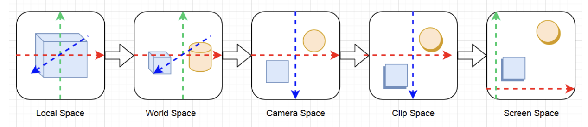
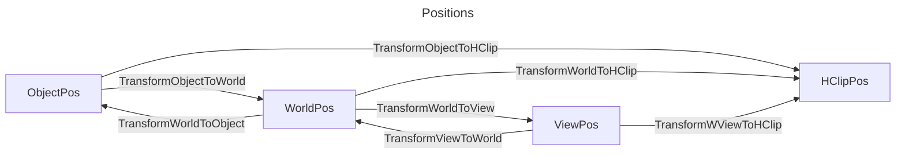
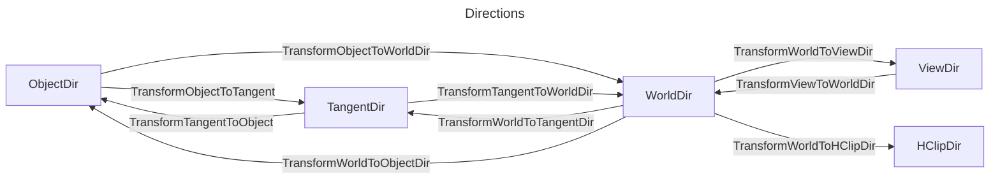
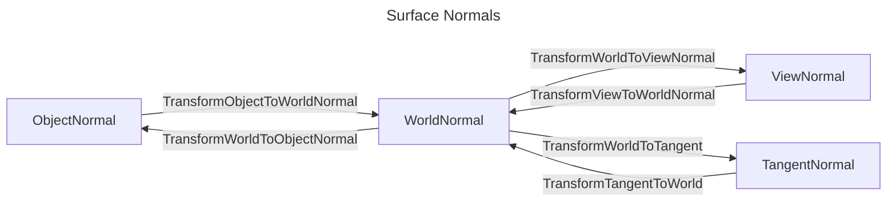

# Coordinate

- 좌표공간




## 유니티 정의 positions

| VertexPositionInputs | Space                                      | AKA           | 타입   | 설명                                                      |
| -------------------- | ------------------------------------------ | ------------- | ------ | --------------------------------------------------------- |
| positionOS           | Object                                     | Local / Model | float3 |                                                           |
| positionWS           | World                                      | Global        | float3 |                                                           |
| positionVS           | View                                       | Camera / Eye  | float3 | 카메라에서 바라볼때                                       |
| positionCS           | Clip (Homogeneous)                         |               | float4 | [-w, w] 카메라 시야에서 안보인 것은 제외, Orthogonal 적용 |
| positionNDC          | Normalized Device Coordinate (Homogeneous) |               | float4 | [0, w] : (x, y, z, w)                                     |


- 동차좌표 homogeneous coordinate
  - 동차좌표는 n차원의 직교좌표를 n+1차원으로 확장한 것이다
  - float3 => float4로 되면서 Homogeneous를 붙임
- Perspective-Correct Interpolation을 위해 Normalized Device Coordinate (Homogeneous)를 사용함.

``` hlsl
    uint2  positionSS;  // Screen space pixel coordinates                       : [0, NumPixels)
    uint2  tileCoord;   // Screen tile coordinates                              : [0, NumTiles)
    float  deviceDepth; // Depth from the depth buffer                          : [0, 1] (typically reversed)
    float  linearDepth; // View space Z coordinate                              : [Near, Far]
```


``` txt
OS  ----------------------- Object Space
 | UNITY_MATRIX_M * OS
WS  ----------------------- World Space
 | UNITY_MATRIX_V * WS
VS  ----------------------- View Space
 | UNITY_MATRIX_P * VS
CS  ----------------------- Clip Space (Homogeneous)
 | NDC    = CS * 0.5
 | NDC.x  =  NDC.x + NDC.w
 | NDC.y  =  NDC.y + NDC.w // DirectX
 | NDC.y  = -NDC.y + NDC.w // OpenGL
 | NDC.zw = CS.zw
NDC ---------------------- Normalized Device Coordinate (Homogeneous) [0..w]
 | pd = (NDC.xyz / NDC.w); // [0, 1] : perspective divide
 | ndc = pd * 2.0 - 1.0;   // [-1, 1]
 |
 |
ndc ---------------------- Normalized Device Coordinate (Nonhomogeneous) [-1..1]
 | float2 uv_Screen = positionNDC.xy / positionNDC.w;
 | float2 uv_Screen = GetNormalizedScreenSpaceUV(positionCS);
uv_Screen ---------------- [0, 1]
 | float2 positionScreen = uv_Screen * _ScreenParams.xy;
positionScreen ----------- [0, screenWidth] / [0, screenHeight]
```

## Transform

- com.unity.render-pipelines.core/ShaderLibrary/SpaceTransforms.hlsl







## UNITY_MATRIX

| Matrix         | 설명                                                       |
| -------------- | ---------------------------------------------------------- |
| UNITY_MATRIX_M | renderer.localToWorldMatrix                                |
| UNITY_MATRIX_V | camera.worldToCameraMatrix                                 |
| UNITY_MATRIX_P | GL.GetGPUProjectionMatrix(camera.projectionMatrix, false); |

- localToWorldMatrix
  - 유니티 4까지는 GPU에 넘겨주기전에 스케일을 가공하여
  - renderer.localToWorldMatrix, transform.localToWorldMatrix가 달랐으나 지금은 같음.

| 카메라 관련               | 렌더링(UNITY_MATRIX_)의 뷰 전방은 `-z`. 카메라 행렬은 에디터와 동일하게 `+z`를 앞으로 사용 |
| ------------------------- | ------------------------------------------------------------------------------------------ |
| UNITY_MATRIX_V            | cam.worldToCameraMatrix                                                                    |
| UNITY_MATRIX_P            | GL.GetGPUProjectionMatrix(camera.projectionMatrix, false)                                  |
| UNITY_MATRIX_I_V          | cam.cameraToWorldMatrix                                                                    |
| UNITY_MATRIX_I_P          | GL.GetGPUProjectionMatrix(camera.projectionMatrix, false).inverse                          |
| unity_WorldToCamera       | Matrix4x4(cam.transform.position, cam.transform.rotation, Vector3.one)                     |
| unity_CameraToWorld       | Matrix4x4(cam.transform.position, cam.transform.rotation, Vector3.one).inverse             |
| unity_CameraProjection    | cam.projectionMatrix                                                                       |
| unity_CameraInvProjection | cam.projectionMatrix.inverse                                                               |

| [_ProjectionParams](https://docs.unity3d.com/Manual/SL-UnityShaderVariables.html) | x   | y          | z         | w            |
| --------------------------------------------------------------------------------- | --- | ---------- | --------- | ------------ |
| DirectX                                                                           | 1   | near plane | far plane | 1 / farplane |
| OpenGL                                                                            | -1  | near plane | far plane | 1 / farplane |

|         | UNITY_REVERSED_Z | UNITY_NEAR_CLIP_VALUE | UNITY_RAW_FAR_CLIP_VALUE |
| ------- | ---------------- | --------------------- | ------------------------ |
| DirectX | 1                | 1                     | 0                        |
| Vulkan  | 1                | 1                     | 0                        |
| OpenGL  | 0                | -1                    | 1                        |

## Pserspective Camera

- <https://chengkehan.github.io/ReconstructPositionFromDepth.html>


``` cs
// Find our current location in the camera's projection space.
Vector3 pt = Camera.main.projectionMatrix.MultiplyPoint(transform.position);

// Matrix4x4.MultiplyPoint
public Vector3 MultiplyPoint(Matrix4x4 mat, Vector3 v)
{
    Vector3 result;
    result.x = mat.m00 * v.x + mat.m01 * v.y + mat.m02 * v.z + mat.m03;
    result.y = mat.m10 * v.x + mat.m11 * v.y + mat.m12 * v.z + mat.m13;
    result.z = mat.m20 * v.x + mat.m21 * v.y + mat.m22 * v.z + mat.m23;
    float num = mat.m30 * v.x + mat.m31 * v.y + mat.m32 * v.z + mat.m33;
    num = 1 / num;
    result.x *= num;
    result.y *= num;
    result.z *= num;
    return result;
}

// z값 구하지 않으면
public Vector3 MultiplyPoint(Matrix4x4 mat, Vector3 v)
{
    Vector3 result;
    result.x = mat.m00 * v.x + mat.m01 * v.y + mat.m02 * v.z + mat.m03;
    result.y = mat.m10 * v.x + mat.m11 * v.y + mat.m12 * v.z + mat.m13;
    float num = mat.m30 * v.x + mat.m31 * v.y + mat.m32 * v.z + mat.m33;
    num = 1 / num;
    result.x *= num;
    result.y *= num;
    return result;
}

// 값을 대입하면
public Vector3 MultiplyPoint(Matrix4x4 mat, Vector3 v)
{
    Vector3 result;
    result.x = mat.m00 * v.x + 0 * v.y + 0 * v.z + 0;
    result.y = 0 * v.x + mat.m11 * v.y + 0 * v.z + 0;
    float num = 0 * v.x + 0 * v.y + -1 * v.z + 0;
    num = 1 / num;
    result.x *= num;
    result.y *= num;
    return result;
}

// 최종적으로
public Vector3 MultiplyPoint(Matrix4x4 mat, Vector3 v)
{
    Vector3 result;
    result.x = mat.m00 * v.x;
    result.y = mat.m11 * v.y;
    float num = -1 * v.z;
    num = 1 / num;
    result.x *= num;
    result.y *= num;
    return result;
}

(X, Y, linearEyeDepth)
positionNDC // [-1, 1]
X = positionNDC.x * linearEyeDepth / mat.m00
Y = positionNDC.x * linearEyeDepth / mat.m11


The zero-based row-column position:
|  _m00, _m01, _m02, _m03 |
|  _m10, _m11, _m12, _m13 |
|  _m20, _m21, _m22, _m23 |
|  _m30, _m31, _m32, _m33 |

The one-based row-column position:
|   _11,  _12,  _13,  _14 |
|   _21,  _22,  _23,  _24 |
|   _31,  _32,  _33,  _34 |
|   _41,  _42,  _43,  _44 |

```

## UV

- texel(`TE`xture + pi`XEL`) coordinate

``` txt
Direct X
(0,0)            (1,0)
  +-------+-------+
  |       |       |
  |       |       |
  +-------+-------+
  |       |       |
  |       |       |
  +-------+-------+
(0,1)            (1,1)


OpenGL / UnityEngine
(0,1)            (1,1)
  +-------+-------+
  |       |       |
  |       |       |
  +-------+-------+
  |       |       |
  |       |       |
  +-------+-------+
(0,0)            (1,0)
```

- 수학적으로 바라보면 모든 2D좌표계를 OpenGL방식으로하면 좌표계를 헷갈릴 걱정이 없다. 하지만, 프로그래밍 하는 입장에서는 DirectX방식이 좀 더 와닿을 것이다.

## Ref

- [Computergrafik - Vorlesung 6 - Coordinate Systems](https://www.youtube.com/watch?v=u_qKLcszwXA)
- [Unity - shader의 World matrix(unity_ObjectToWorld)를 수작업으로 구성](https://www.sysnet.pe.kr/2/0/11633)
- [Unity - shader의 Camera matrix(UNITY_MATRIX_V)를 수작업으로 구성](https://www.sysnet.pe.kr/2/0/11692)
- [Unity - unity_CameraWorldClipPlanes 내장 변수 의미](https://www.sysnet.pe.kr/2/0/11697)
- [Unity - shader의 원근 투영(Perspective projection) 행렬(UNITY_MATRIX_P)을 수작업으로 구성](https://www.sysnet.pe.kr/2/0/11695)
- [렌더링 파이프라인의 좌표 공간들](http://rapapa.net/?p=3531)
- [Look At Transformation Matrix in Vertex Shader](https://shahriyarshahrabi.medium.com/look-at-transformation-matrix-in-vertex-shader-81dab5f4fc4)
- [transform.localToWorldMatrix](https://docs.unity3d.com/ScriptReference/Transform-localToWorldMatrix.html)
- [Renderer.localToWorldMatrix](https://docs.unity3d.com/ScriptReference/Renderer-localToWorldMatrix.html)
- [Camera.worldToCameraMatrix](https://docs.unity3d.com/ScriptReference/Camera-worldToCameraMatrix.html)
- [Camera.projectionMatrix](https://docs.unity3d.com/ScriptReference/Camera-projectionMatrix.html)
- [GL.GetGPUProjectionMatrix](https://docs.unity3d.com/ScriptReference/GL.GetGPUProjectionMatrix.html)
- <http://blog.hvidtfeldts.net/index.php/2014/01/combining-ray-tracing-and-polygons/>
