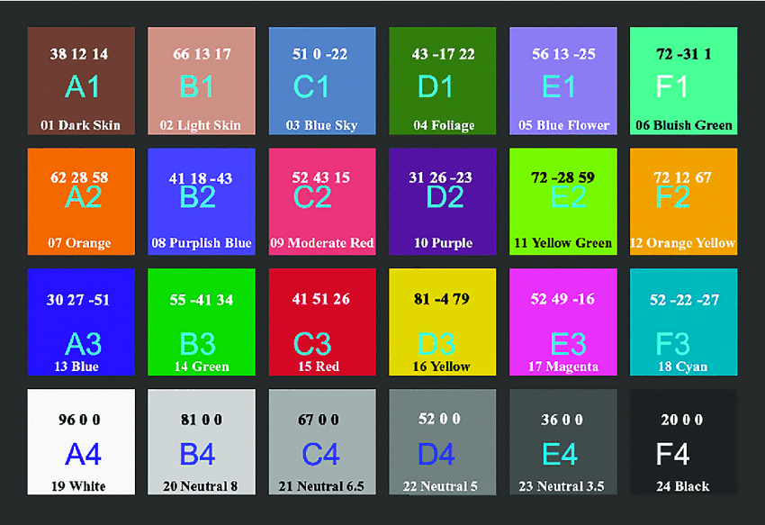

# Color Checker

- New 2023.2.0a16 Entries since 2023.2.0a15
  - Editor: Added the Color Checker, which is a tool used to calibrate lighting and post process. The Color Checker is an object that the user can add through GameObject > Rendering > Color Checker Tool. The tool is meant only as a production tool for lighting artists and won't be saved in Build.

- 주의사항
  - 컬러 차트를 촬영하고자 하는 피사체에 최대한 붙여야 함.

## Ref

- <https://github.com/colour-science/colour-nuke/tree/master/colour_nuke/resources/images/ColorChecker2014>