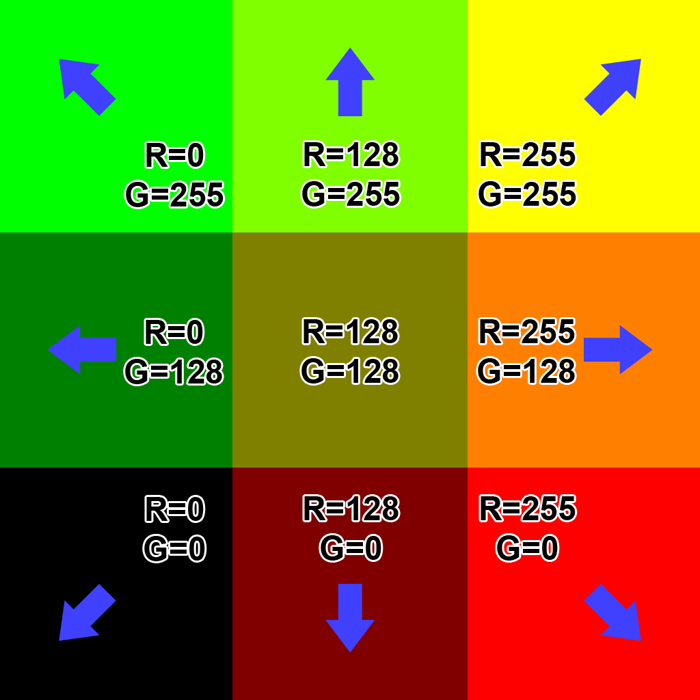

# SpriteFlipBook_FlowMap_MotionVector

## SpriteFlipBook

``` hlsl
// uv         : [0, 1]
// frame      : time * FramePerSeconds
// imageCount : (ColumnCount, RowCount)
half2 GetSubUV(in half2 uv, in half frame, in uint2 imageCount)
{

    // ex)
    // frame      = 9.9
    // imageCount = (8, 8)

    half2 scale = 1.0 / imageCount;           // scale = (0.125, 0.125)

    // floor : 소수점이하 버림.
    // frac  : 소수점이하 반환.
    half index = floor(frame);                 // index = 9
    // half index = frame - frac(frame);
    
    // fmod  : 나머지 반환.
    // offset.x = 9 % 8                                     => 1
    // offset.y = -1 - floor(9 * 0.125) => -1 -floor(1.125) => -2
    half2 offset = half2(
      fmod(index, imageCount.x),
      -1 - floor(index * scale.x)
    );

    // y가 -1로 시작하는 이유.
    //  - uv좌표     : 좌하단
    //  - 이미지시트 : 좌상단
    // 기준점을 uv(0, 0)을 sheet(0, -1)로 변환해야함.

    return (uv + offset) * scale;
}

half frameNumber = _Time.y * _FramesPerSeconds;
half2 subUV = GetSubUV(IN.uv, frameNumber, uint2(_ColumnsX, _RowsY));
```

## FlowMap

- [FlowMapPainter](http://teckartist.com/?page_id=107)
- [mnpshino - 모션벡터와 플로우 맵 (2)](https://blog.naver.com/mnpshino/221456514365)
- [SIGGRAPH2010 presentation Water Flow in Portal 2](https://www.slideshare.net/alexvlachos/)
- <https://catlikecoding.com/unity/tutorials/flow/texture-distortion/>
- <http://wiki.polycount.com/wiki/Flow_map>
- [youtube: Flow Map Material Setup in 13 Minutes](https://www.youtube.com/watch?v=tEr3NE_XLbc)
- [GDC2012 - Water Technology of Uncharted](https://www.gdcvault.com/play/1015309/Water-Technology-of)
- [Graphics Runner: Animating Water Using Flow Maps by Kyle Hayward](http://graphicsrunner.blogspot.com/2010/08/water-using-flow-maps.html)
- [http://ttmayrin.tistory.com/40](https://web.archive.org/web/20170508024645/http://ttmayrin.tistory.com/40)




``` hlsl
half2 flowTex = SAMPLE_TEXTURE2D(_FlowTex, sampler_FlowTex, IN.uv).rg;

// flowTex[0, 1] => [-1, 1]
half2 flowUV = flowTex * 2.0 - 1.0;

// or flowTex[0, 1] => [-0.5, 0.5]
// half2 flowUV = flowTex - 0.5;

// [-1, 1] 선형 반복.
// frac  : 소수점이하 반환.
half flowLerp = abs((frac(_Time.x * _FlowSpeed) - 0.5) * 2.0);

half2 uv0 = IN.uv + flowUV * frac(_Time.x * _FlowSpeed);
half2 uv1 = IN.uv + flowUV * frac(_Time.x * _FlowSpeed + 0.5);

half3 mainTex0 = SAMPLE_TEXTURE2D(_MainTex, sampler_MainTex, uv0).rgb;
half3 mainTex1 = SAMPLE_TEXTURE2D(_MainTex, sampler_MainTex, uv1).rgb;

half3 finalColor = lerp(mainTex0, mainTex1, flowLerp);
```

## MotionVector

- <http://www.klemenlozar.com/frame-blending-with-motion-vectors/>
- [GDC2012 - The Tricks Up Our Sleeves: A Walkthrough of the Special FX of Uncharted 3: Drake’s Deception](https://www.gdcvault.com/browse/gdc-12/play/1015655)

``` hlsl
half frameNumber = _Time.y * _FramesPerSeconds;
uint2 imageCount = uint2(_ColumnsX, _RowsY);

OUT.frameNumber = frameNumber;
OUT.subUV0 = GetSubUV(IN.uv, frameNumber, imageCount);
OUT.subUV1 = GetSubUV(IN.uv, frameNumber + 1, imageCount);

// -------------------
// flowTex[0, 1] => [-1, 1]
half2 flowTex0 = SAMPLE_TEXTURE2D(_FlowTex, sampler_FlowTex, IN.subUV0).rg;
half2 flowTex1 = SAMPLE_TEXTURE2D(_FlowTex, sampler_FlowTex, IN.subUV1).rg;
flowTex0 = flowTex0 * 2.0 - 1.0;
flowTex1 = flowTex1 * 2.0 - 1.0;

half interval = frac(IN.frameNumber);

half2 mainUV0 = IN.subUV0 - (flowTex0 * interval * _DistortionStrength);
half2 mainUV1 = IN.subUV1 + (flowTex1 * (1 - interval) * _DistortionStrength);
half4 mainTex0 = SAMPLE_TEXTURE2D(_MainTex, sampler_MainTex, mainUV0);
half4 mainTex1 = SAMPLE_TEXTURE2D(_MainTex, sampler_MainTex, mainUV1);

half4 finalColor = lerp(mainTex0, mainTex1, interval);
```
