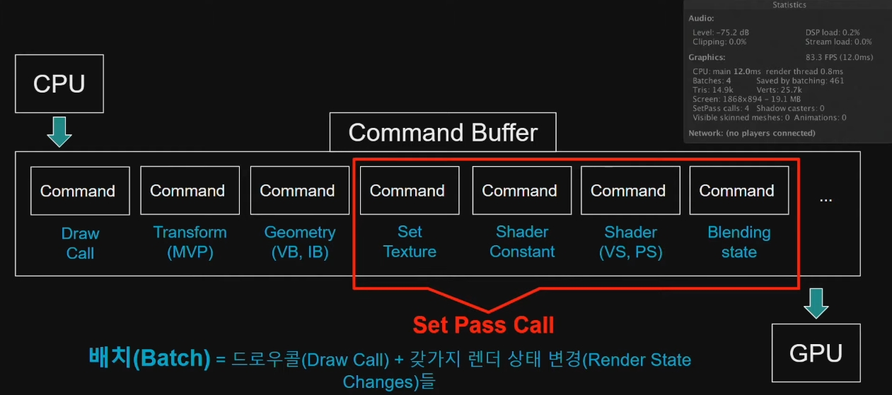

# DrawCall

- [유니티 초보자도 이해하는 URP와 성능, 그리고 모바일까지🔥🔥](https://youtu.be/wNFjsi6MjAQ)

- DrawCall : CPU가 GPU에게 그려라(Draw)라고 명령하는 것
  - CPU성능에 영향

- [Dev Weeks: 성능을 고려한 파이프라인, Universal Render Pipeline](https://youtu.be/UsyvT36vqpU?t=1460)
- [[유니티 TIPS] 유니티 최적화를 위한 필수 기본기! Batching 방법 소개](https://youtu.be/w14yjBlfNeQ?si=m_G8ru6j69EBit3i)



| Render States  |
| -------------- |
| Shader         |
| Mesh           |
| Alpha Blending |
| Z Test         |
| Texture 0...N  |
| ...            |

| Stats             |                                 |
| ----------------- | ------------------------------- |
| Batches           | DrawCall + Render State Changes |
| Saved by Batching | Batch들을 모은 횟수             |
| SetPass calls     | 값비싼 커맨드 호출 수           |

| Command          | SetPass calls |                                     |
| ---------------- | ------------- | ----------------------------------- |
| Draw Call        |               | DrawIndxed()자체는 비용이 별로 안듬 |
| Transform(MVP)   |               |                                     |
| Geometry(VB, IB) |               |                                     |
| SetTexture       | o             |                                     |
| Shader Constant  | o             |                                     |
| Shader (VS, PS)  | o             |                                     |
| Blending State   | o             |                                     |
| ...              |               |                                     |


- Batching
  - 하나로 묶음
  - 장점: 드로우 콜 감소
  - 단점: 메모리를 더 필요함.

## SRP Batcher

- <https://docs.unity3d.com/Manual/SRPBatcher.html>
- Material의 정보와 Object의 정보를 GPU 메모리에 상주

|                  | 배치 기준               |
| ---------------- | ----------------------- |
| Built-in(legacy) | 머테리얼                |
| SRP Batcher      | 셰이더 (Shader Variant) |

``` hlsl
// 메터리얼별로 상수버퍼(Constant buffer)를 만들어 주어
// 동일한 셰이더를 여러 머터리얼이 사용하는 경우 앞서 만든 상수버퍼를 이용하셔 성능 향상 도모.
// (상수버퍼안 개별 값을 전달하는게 아니라 상수버퍼 자체를 전달)
// 메모리 정렬(16바이트)가 되어 있는게 좋은데 유니티에서는 어떻게 내부적으로 되었는지 모르겠다.
CBUFFER_START(UnityPerMaterial)
float _Blabla;
CBUFFER_END

CBUFFER_START(UnityPerDraw)
    float4x4 unity_ObjectToWorld;
    float4x4 unity_WorldToObject;
    real4 unity_WorldTransformParams;
CBUFFER_END

public CustomRenderPipeline ()
{
    GraphicsSettings.useScriptableRenderPipelineBatching = true;
}
```

## GPU Instancing

- <https://docs.unity3d.com/Manual/GPUInstancing.html>
- 동일한 메시끼리 한 번의 드로우콜로 처리
- 배칭과 달리 동일한 메시의 복사본들을 만든다는 점에서 구분. 배칭보다 런타임 오버헤드가 적다.
- CPU에서 처리해서 보내준 정보를 GPU에서 별도의 버퍼에 담고 인스턴싱 처리를 함.
- Renderer
  - Mesh Renderer에만 사용
  - Skinned Mesh Renderer에는 사용 불가(케릭터 불가)

``` hlsl
#pragma multi_compile_instancing

// ref: https://github.com/Unity-Technologies/Graphics/blob/master/com.unity.render-pipelines.core/ShaderLibrary/UnityInstancing.hlsl
#include "Packages/com.unity.render-pipelines.core/ShaderLibrary/UnityInstancing.hlsl"

UNITY_INSTANCING_BUFFER_START(UnityPerMaterial)
    UNITY_DEFINE_INSTANCED_PROP(float4, _BaseColor)
UNITY_INSTANCING_BUFFER_END(UnityPerMaterial)

struct APPtoVS
{
    UNITY_VERTEX_INPUT_INSTANCE_ID
};

struct VStoFS
{
    UNITY_VERTEX_INPUT_INSTANCE_ID 
};

VStoFS vert(in APPtoVS IN)
{
    UNITY_SETUP_INSTANCE_ID(IN);

    VStoFS OUT;
    ZERO_INITIALIZE(VStoFS, OUT);
    UNITY_TRANSFER_INSTANCE_ID(IN, OUT);
    return OUT;
}

half4 frag(in VStoFS IN)
{
    UNITY_SETUP_INSTANCE_ID(IN);
    half4 color = UNITY_ACCESS_INSTANCED_PROP(UnityPerMaterial, _Color);
    return 1;
}

```

``` cs
static readonly int _BaseColor = Shader.PropertyToID("_BaseColor");

Mesh _mesh;
Material _material;
MaterialPropertyBlock _block;

Matrix4x4[] _matrices;
Vector4[] _baseColors ;

_block = new MaterialPropertyBlock();
_block.SetVectorArray(baseColorId, baseColors);

// ref: https://docs.unity3d.com/ScriptReference/Graphics.DrawMeshInstanced.html
Graphics.DrawMeshInstanced(_mesh, 0, _material, _matrices, _matrices.Length, block);
```

## Dynamic Batching

- 동일한 머티리얼을 공유하는 여러 개의 작은 메시를 하나의 더 큰 메시로 결합하여 그림
  - 공유하지 않은 개별 머티리얼에는 동작 안함
  - 작은 메시에만 적합
- 우선순위
  - SRP Batcher가 Dynamic Batching보다 우선됨.

