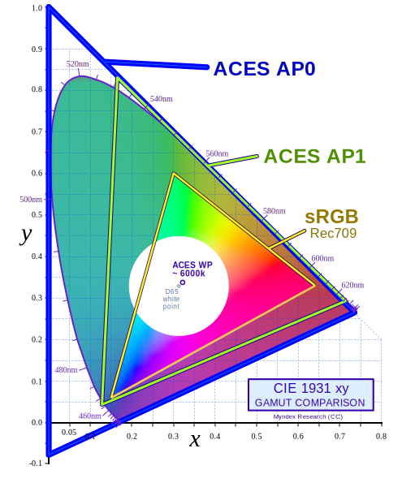
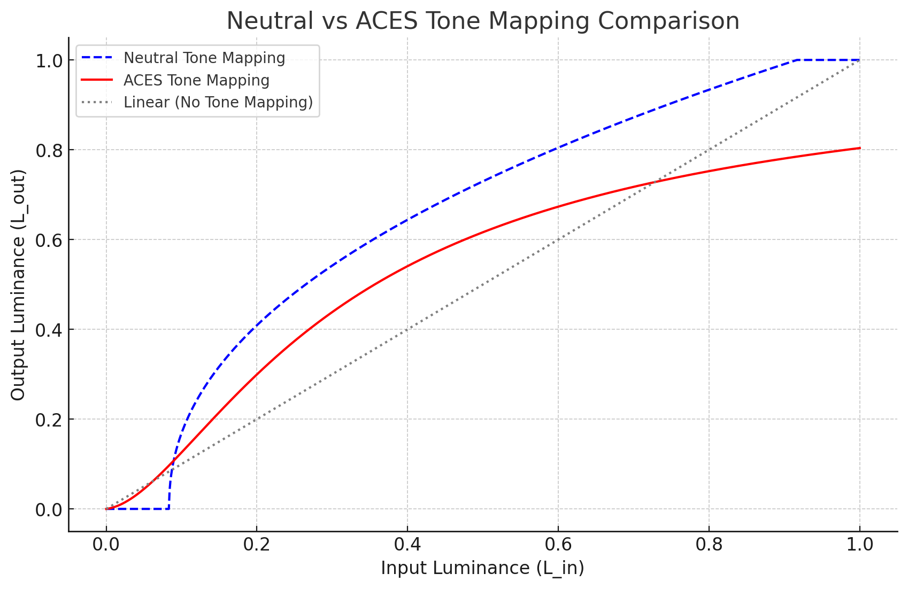

# ACES

- `A`cademy `C`olor `E`ncoding `S`ystem 

https://en.wikipedia.org/wiki/Academy_Color_Encoding_System
https://github.com/ampas/aces-dev
https://www.slideshare.net/hpduiker/acescg-a-common-color-encoding-for-visual-effects-applications


ACES 1.0.X의 모든 출력 변환에 해당하며 여전히 그렇습니다. ACES 1.1 릴리스에서는 단일 단계로 일부 새로운 HDR 출력 변환을 도입했으며 이를 SSTS(Single Stage Tone Scale)라고 합니다.


``` txt
https://github.com/Unity-Technologies/Graphics/blob/e42df452b62857a60944aed34f02efa1bda50018/Packages/com.unity.render-pipelines.universal/Shaders/PostProcessing/LutBuilderHdr.shader

float4 FragLutBuilderHdr(Varyings input) : SV_Target

texcoord

==LUT=>            Alexa LogC (El 1000)
==LogCToLinear=>   Linear
==LinearToLMS=>    LMS * _ColorBalance
==LMSToLinear=>    Linear
==unity_to_ACES=>  ACES2065-1 (AP0 w/ linear encoding)
==ACES_to_ACEScc=> ACEScc (AP1 w/ logarithmic encoding)
  
colorLog = (colorLog - ACEScc_MIDGRAY) * _HueSatCon.z + ACEScc_MIDGRAY;

==ACEScc_to_ACES=> ACES2065-1 (AP0 w/ linear encoding)
==ACES_to_ACEScg=> ACEScg (AP1 w/ linear encoding)
==ACEScg_to_ACES=> ACES2065-1 (AP0 w/ linear encoding)
  
float3 oces = RRT(aces);
float3 odt = ODT_RGBmonitor_100nits_dim(oces);
return odt;

```

- Alexa LogC (El 1000)
  - Alexa 카메라에서 사용하는 로그 색상 프로파일(LogC)로, ISO 1000에서 촬영한 이미지를 나타냅니다
  - Alexa : 카메라 제조사인 ARRI에서 개발한 카메라 시리즈의 이름
  - LogC : Log Curve. ARRI 카메라에서 사용되는 로그 색상 프로파일
  - El 1000: Exposure Level - 노출이 1000 ISO(International Standards Organization)
- AP0 ACES 색 공간의 기반
  - ACES2065-1
- AP1 실제 사용에 적합하게 최적화된 색 영역
  - ACEScg
  - ACEScc
  - https://community.acescentral.com/t/acescc-vs-acescct/485/18


By Myndex - Own work, CC BY-SA 4.0, https://commons.wikimedia.org/w/index.php?curid=141086322

LMS color space
  `L`ong, `M`edium, `S`hort
    Red(장파장), Green(중파장), Blue(단파장)


|> 입력 (srgb/linear/ACEScg 텍스쳐)
|> IDT
  변환 예) sRGB/Rec.709의 0,1,0 => ACEScg 0.3, 0.9, 0.1
|> ACEScg
  렌더링 작업공간
|> RRT
    - ACEScc : 최종작업 후 리니어한 ACES를 로그화 하는 공정
    - ACES RRT는 시청 조건이 어두운 극장 전시를 위해 설계되었습니다. 영화 콘텐츠는 어두운 주변을 보상하기 위해 더 많은 대비로 작성되는 경향이 있습니다.
    - Output Color Encoding Specification (OCES)
|> ODT | projector

 


- IDT : `I`nput `D`evice `T`ransform
- RRT : `R`eference `R`endering `T`ransform
  - Transform scene linear color to film look color.
- ODT : `O`utput `D`evice `T`ransform
  - Transform scene linear color to device signal.

- 단점
  - Fixed variations. ODT only support 1000/2000/4000nits display.
  - Filmic look baked in RRT.


1. 상수 조정 시의 결과 비교
| 상수 | 낮게 설정                        | 높게 설정                    |
| ---- | -------------------------------- | ---------------------------- |
| A    | 하이라이트 약화                  | 강렬한 하이라이트 생성       |
| B    | 어두운 이미지 유지               | 전반적으로 밝은 이미지 생성  |
| C    | 명암 차이 축소 (부드러운 이미지) | 명암 차이 증가 (극명한 대비) |
| D    | 암부 강조                        | 중간 톤과 하이라이트 강조    |
| E    | 강한 클리핑                      | 부드러운 하이라이트 감쇠     |


A: 입력 밝기의 증폭 계수

밝은 영역을 얼마나 더 부각할지를 결정합니다.
이 값이 커지면, 높은 밝기의 영역이 더욱 강조되어 더 강렬한 하이라이트가 생성됩니다.
높은 다이내믹 레인지를 처리하기 위해 꼭 필요한 상수입니다.
예시: 햇빛이 반사되는 표면이 더 뚜렷해짐.
B: 밝기 편향 조정 (Offset)

어두운 영역을 조정하는 역할을 합니다.
이 상수는 입력 값에 일정한 오프셋을 추가해 암부의 디테일을 보존하도록 합니다.
B가 높으면 전체적으로 더 밝게 보이지만, 지나치면 화면 전체가 희미해질 수 있습니다.
C: 대조(Contrast) 계수

출력 이미지의 명암 대비를 조절합니다.
큰 값일수록 어두운 영역과 밝은 영역 간의 차이를 더 극명하게 만들어 대조가 강해집니다.
영화 같은 극적인 톤을 원할 때 중요한 요소입니다.
D: 대조에 대한 기준점

C와 함께 사용되며 명암 조정의 중심점을 설정합니다.
어두운 영역과 밝은 영역 사이의 밸런스 포인트를 결정합니다.
이 상수가 잘못 설정되면 색 균형이 깨져 하이라이트나 암부가 지나치게 강조될 수 있습니다.
E: 하이라이트 감쇠 계수

매우 밝은 영역에서의 하이라이트 클리핑 방지를 담당합니다.
이 상수는 밝은 부분의 값이 자연스럽게 감쇠되도록 해줍니다.
예시: 햇빛이나 폭발 장면에서 부드럽게 하이라이트가 사라짐.
E가 작을수록 톤 매핑된 결과가 더 부드럽고 자연스럽게 나타나지만, 너무 작으면 이미지가 평평해 보일 수 있습니다.





``` hlsl
// Neutral Tone Mapping Shader
float3 NeutralTonemap(float3 color, float contrast, float brightness, float gamma) {
    // Contrast adjustment
    color = (color - 0.5) * contrast + 0.5;

    // Brightness adjustment
    color += brightness;

    // Clamp color to avoid overflow
    color = saturate(color);

    // Gamma correction
    color = pow(color, 1.0 / gamma);

    return color;
}


// ACES Approximation Tone Mapping Shader
float3 ACESFilm(float3 color) {
    const float A = 2.51;
    const float B = 0.03;
    const float C = 2.43;
    const float D = 0.59;
    const float E = 0.14;

    // Apply the ACES approximation formula
    color = (color * (A * color + B)) / (color * (C * color + D) + E);

    // Clamp color to avoid artifacts
    return saturate(color);
}

```


GT
 Gran Turismo Tonemapping.
 https://github.com/yaoling1997/GT-ToneMapping
https://github.com/yaoling1997/GT-ToneMapping

Practical HDR and Wide Color Techniques in Gran Turismo SPORT - SIGGRAPH ASIA 2018


https://draftdocs.acescentral.com/system-components/whats-new/