# SRP Overview

Sobel Filter

  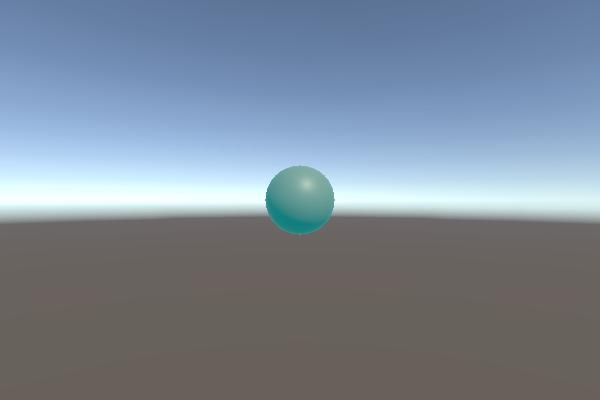
  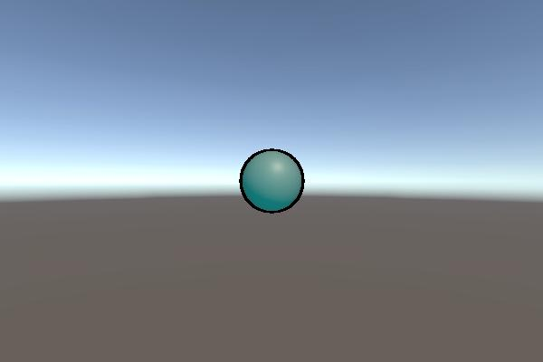

Bloom(with DualFilter)

 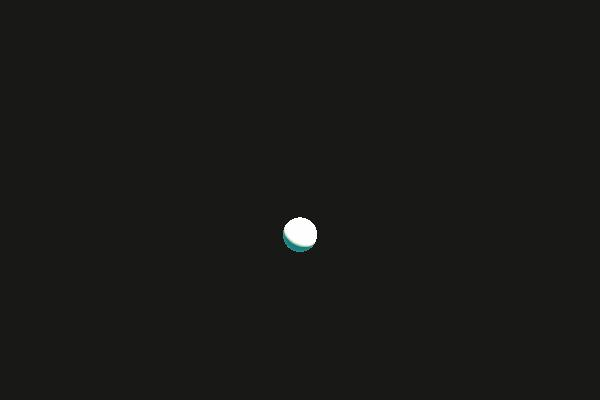
 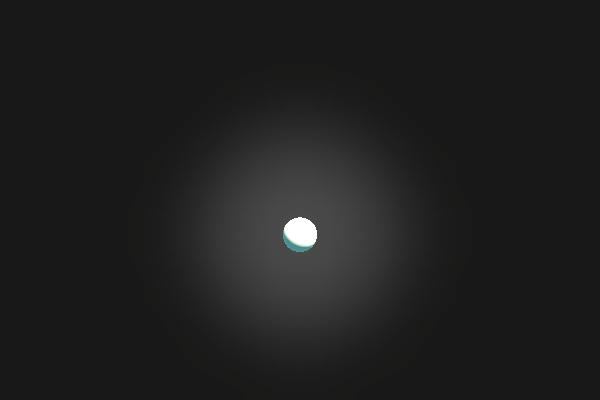

Light Streak

 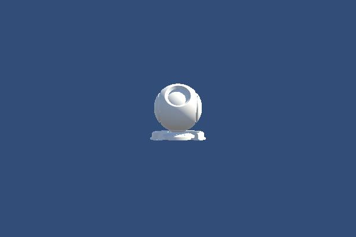
 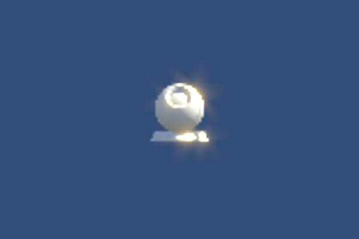

Screen Space Ambient Occlusion

 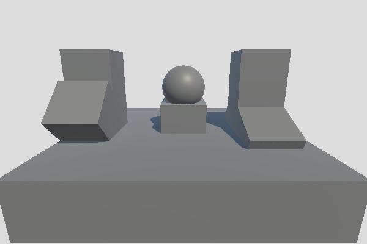
 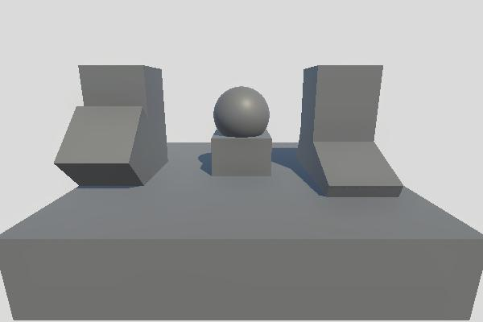

 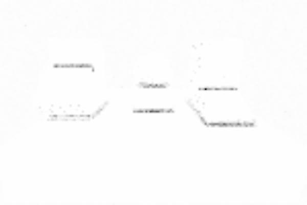
 

Screen Space Global Illumination

 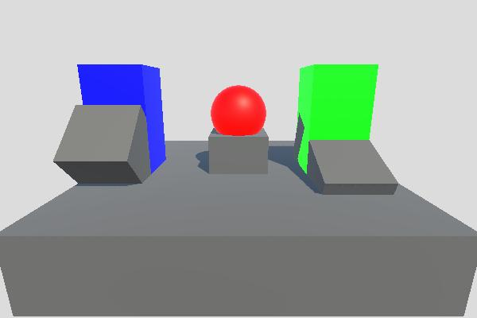
 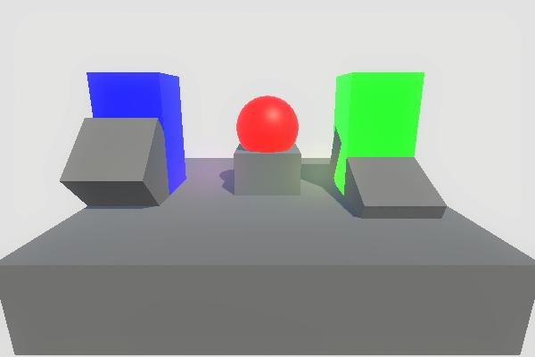

 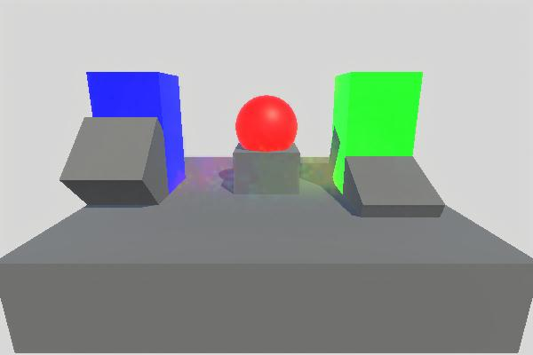
 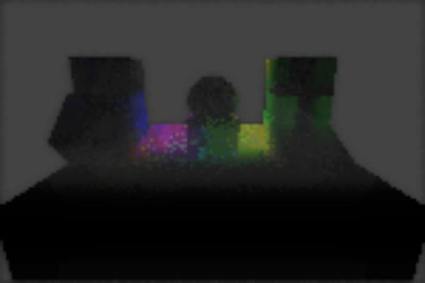

Light Shaft

 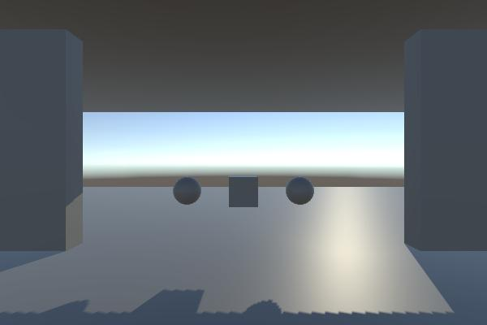
 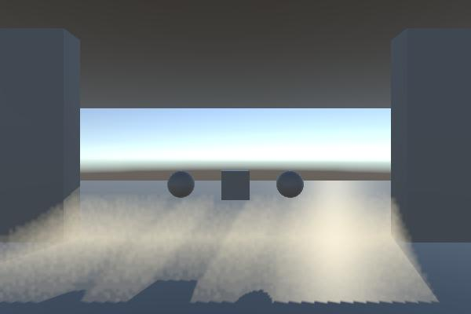

FXAA

  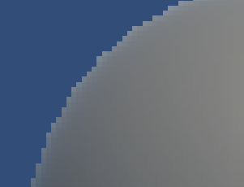
  

