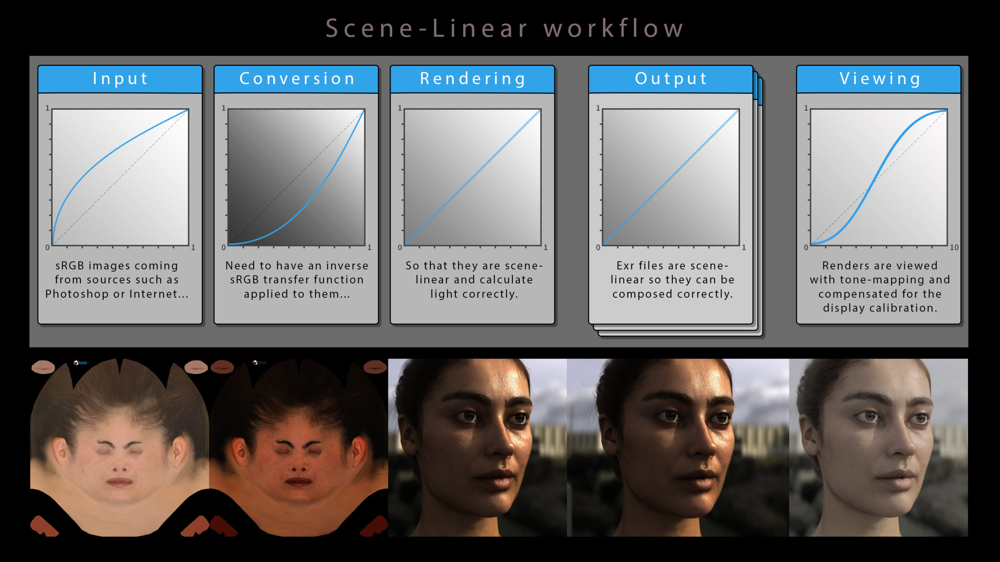
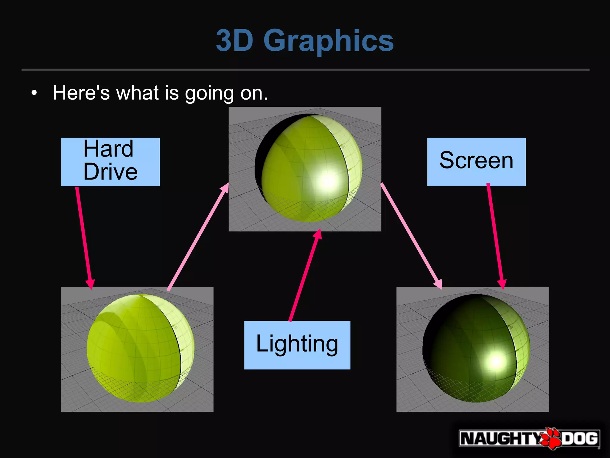
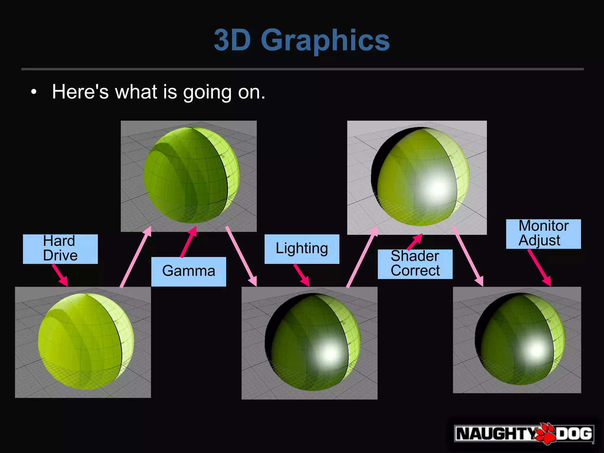
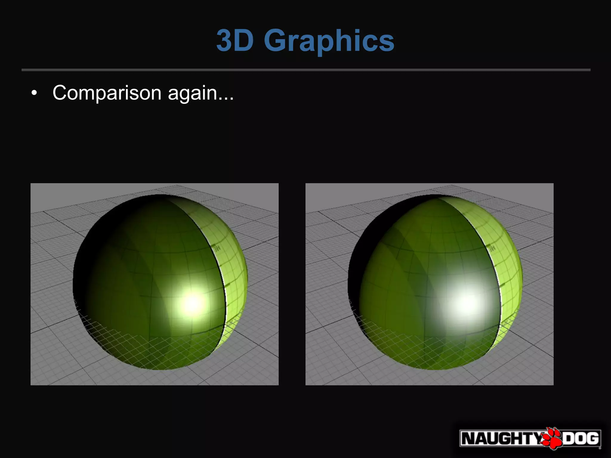
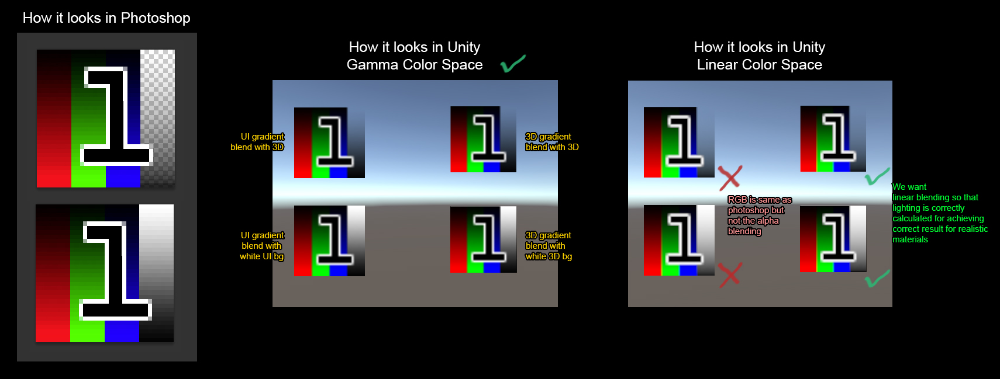
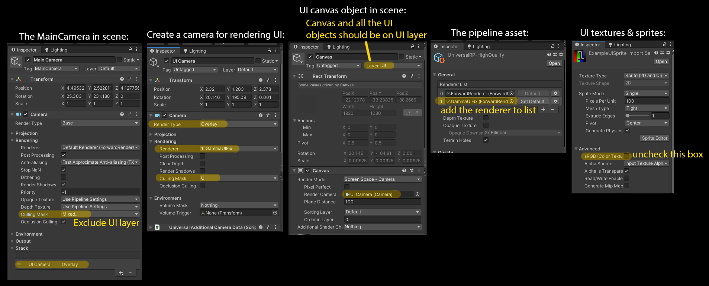

# Linear / Gamma

Unity에는 Gamma와 Linear를 선택할 수 있는 Color Space항목이 있다.

`Edit> Project Settings> Player> Other Settings> Rendering> Color Space`


## Gamma / Linear Color Space 결과물 차이

일단 차이부터 알아보자.

- [unity: Linear or gamma workflow](https://docs.unity3d.com/2021.1/Documentation/Manual/LinearRendering-LinearOrGammaWorkflow.html)


- 감마 색 공간에서의 블렌딩은 결과적으로 채도와 밝기가 과도하게 높습니다

이러한 조명 강도, 블렌딩 차이는 **왜** 생기는 것일까?

## Gamma와 Linear의 관계

같은 RGB값이라도 Linear와 Gamma상태에서 보여지는 색이 다르다.


- 감마 보정([wiki: Gamma correction](https://en.wikipedia.org/w/index.php?title=Gamma_correction))

## Gamma Encode/Decode

Linear는 무엇이고 Gamma는 무엇인가? 


| 선          | Gamma  | Gamma Value                  | 공간               |
| ----------- | ------ | ---------------------------- | ------------------ |
| 초록-위     | encode | pow(x, 0.45) (0.45 == 1/2.2) |                    |
| 검정-가운데 | -      | pow(x, 1.0 )                 | Linear             |
| 빨강-아래   | decode | pow(x, 2.2 )                 | Gamma / sRGB / CRT |

- [wiki: sRGB](https://en.wikipedia.org/wiki/SRGB) : standard RGB color space.


## Gamma / Linear Color Space 작업 환경

Linear와 Gamma가 **왜** 작업 결과물에 영향을 주는가?




- Gamma Pipeline에서는 빛의 연산 결과가 Linear환경에서 연산되고 모니터에는 Gamam가 적용된 상태로 표시된다.
- 빛의 연산 결과도 Linear환경으로 표시하려면, 모니터에 Gamma가 적용되어 어두워지기전에, 미리 밝게해두면 Linear한 빛의 연산 결과를 모니터에서 확인할 수 있게 된다.

### 이미지 제작 환경(감마 보정 환경)

| 환경   | Gamma correction                | 설명                                                                                  |
| ------ | ------------------------------- | ------------------------------------------------------------------------------------- |
| 포토샵 | 편집시 decode(2.2) / 저장시 (1) | 포토샵 기본셋팅시: 편집(모니터 Gamma환경) / 저장(모니터 Gamma환경이 아닌 원래 그대로) |
| 셰이더 | 1                               | 셰이더 계산은 Linear 환경이다                                                         |
| 모니터 | decode(2.2)                     |                                                                                       |

### Rendering - Gamma Color Space

| 연산   | pow(0.5, x)    | 값                       |
| ------ | -------------- | ------------------------ |
| encode | pow(0.5, 0.45) | 0.7 (0.7320428479728127) |
| -      | pow(0.5, 1)    | 0.5                      |
| decode | pow(0.5, 2.2)  | 0.2 (0.217637640824031)  |

| 환경           | 연산   | 텍스쳐 | 셰이딩 |                               |
| -------------- | ------ | ------ | ------ | ----------------------------- |
| 모니터(포토샵) | decode | 0.2    |        |                               |
| 저장           | encode | 0.5    |        | 포토샵 컬러 이미지 파일       |
| 셰이더(모델)   | -      | 0.5    | 0.5    | 이미지가 밝아진 상태에서 연산 |
| 모니터(게임)   | decode | 0.2    | 0.2    |                               |

- 문제점
  - 광원 감쇠
    - 감마 파이프라인에서는 셰이더 연산이 어둡게 보임.(셰이딩 값 참조)
  - 광원 강도 반응
    - 광원의 강도에 따라 선형적이 아닌 비 선형적으로 밝아지거나 어두워진다.
  - 블렌딩
    - 채도와 밝기가 과도하게 높아질 수 있음.

### Rendering - Linear Color Space

- **Gamma Correction**
  - Gamma를 1.0으로 하는게 Gamma Correction이라고 하는 인터넷 문서들이 있는데, 그렇게 이해하면 안됨.
  - [Wiki](https://en.wikipedia.org/wiki/Gamma_correction)에는 Gamma Correction 자체가 Gamma 연산을 하는 걸로 정의되어 있음.
  - 게임에서는 출력장치로 출력하기 좋게 Gamma를 보정하는 작업을 Gamma Correction이라 칭하는게 좀 더 게임개발에 알맞음.
    - 모니터로 출력시 어둡게 출력되는데, 출력 전에 밝게 후보정하는 작업.

#### sRGB 보정

- sRGB 체크시 RGB채널에 대한 Gamma Decode을 수행시(단, A채널은 그대로).
- **alpha에 대해선 체크 여부에 상관없이 decode적용 안함.**
  - 남는 alpha채널에 Mask맵 같은걸 찡겨 넣을 수 있음.
  - 다만, 게임에서의 리니어 알파가 포토샵같이 비선형의 알파가 다름으로써 UI 알파블렌딩에서 문제가 됨.
    - UI의 알파처리는 따로 처리해줘야 함.

| 환경                   | 연산   | 텍스쳐 | 셰이딩 |                                           |
| ---------------------- | ------ | ------ | ------ | ----------------------------------------- |
| 모니터(포토샵)         | decode | 0.2    |        |                                           |
| 저장                   | encode | 0.5    |        | 포토샵 컬러 이미지 파일                   |
| __sRGB옵션__           | decode | 0.2    |        | sRGB Check시 (Gamma decode적용)           |
| 셰이더(모델)           | -      | 0.2    | 0.5    | 이미지가 작업 환경과 동일한 환경에서 연산 |
| 셰이더(포스트프로세스) | encode | 0.5    | 0.7    | 디스플레이에 보여주기 전에 최종 후처리    |
| 모니터(게임)           | decode | 0.2    | 0.5    |                                           |

#### sRGB 미보정

- 컬러 텍스쳐를 sRGB 체크를 하지 않으면, 색이 떠보이게됨.
- ORM
  - Normal 텍스쳐는 수치 그 자체이므로 sRGB옵션 자체가 없음.
  - Roughness/Occlusion는 sRGB 체크를 해지해야함.
- 기타 수치 텍스쳐
  - flowmap 등등...

| 환경                   | 연산   | 텍스쳐 | 셰이딩 |                                        |
| ---------------------- | ------ | ------ | ------ | -------------------------------------- |
| 저장                   | encode | 0.5    |        | 이미지 파일                            |
| 셰이더(모델)           | -      | 0.5    | 0.5    |                                        |
| 셰이더(포스트프로세스) | encode | 0.7    | 0.7    | 디스플레이에 보여주기 전에 최종 후처리 |
| 모니터(게임)           | decode | 0.5    | 0.5    |                                        |


## 종합



| step       | 환경           | 텍스쳐 | 셰이딩 |
| ---------- | -------------- | ------ | ------ |
|            | 모니터(포토샵) | 0.2    |        |
| Hard Drive | 저장           | 0.5    |        |
| Lighting   | 셰이더(모델)   | 0.5    | 0.5    |
| Screen     | 모니터(게임)   | 0.2    | 0.2    |



| Step           | 환경                   | 텍스쳐 | 셰이딩 |
| -------------- | ---------------------- | ------ | ------ |
|                | 모니터(포토샵)         | 0.2    |        |
| Hard Drive     | 저장                   | 0.5    |        |
| Gamma          | __sRGB옵션__           | 0.2    |        |
| Lighting       | 셰이더(모델)           | 0.2    | 0.5    |
| Shader Correct | 셰이더(포스트프로세스) | 0.5    | 0.7    |
| Monitor Adjust | 모니터(게임)           | 0.2    | 0.5    |



좌 감마 // 우 리니어

## Linear Color Space에서 작업시 주의할 점

- 플렛폼 지원
- sRGB로 보정이 필요한 텍스쳐 구분
- UI 텍스쳐의 Alpha값

### 플렛폼 지원

- OpenGL ES 2.0 이하는 Gamma만 지원.
  - <https://blogs.unity3d.com/kr/2016/12/07/linear-rendering-support-on-android-and-ios/>
  - <https://developer.android.com/about/dashboards/index.html#OpenGL>

- Linear를 위한 모바일 최소 사양

| platform | version                                 | API                    |
| -------- | --------------------------------------- | ---------------------- |
| Android  | Android 4.3 / API level 18 / Jelly Bean | OpenGL ES 3.0 / Vulkan |
| iOS      | 8.0                                     | Metal                  |


### sRGB로 보정이 필요한 텍스쳐 구분


1. 데이터를 그대로 다루는것은 Linear로
2. 나머지 Albedo / Emmission는 sRGB 체크로 Gamma Decode 하도록

| Image                      | sRGB 체크 |                                        |
| -------------------------- | --------- | -------------------------------------- |
| Albedo                     | O         | Gamma Decode 적용                      |
| Albedo + Smoothness(alpha) | O         | sRGB는 RGB값에만 적용. Alpha는 미적용. |
| DataTexture                | X         | 데이터 그대로 사용                     |
| NormalMap                  | 옵션없음  | 데이터 그대로 사용                     |


### UI 텍스쳐의 Alpha값

- Linear환경으로 보다 풍부한 표현력을 얻었지만, UI색상의 알파블랜딩이 제대로 되지 않는 현상이 있다.
  - Linear개념으로 보면 정확한 계산이지만, 포토샵 작업자 관점에서는 아니다.
- sRGB옵션은 RGB에만 영향을 줌으로, Alpha를 처리함에 있어 추가 작업을 해 주어야 한다.



몇가지 방법이 있다

- 포토샵 강제 설정하거나...
- UI카메라와 SRP의 활용하거나..

#### Photoshop 설정

- 처음부터 Linear로 저장시켜버리자
- 포토샵 Color Settings > Advanced > Blend RPG Colors Using Gamma: 1.00
- 작업비용
  - 디자이너들은 작업하기 불편...
  - 프로그래머의 추가 작업 불필요.

#### UI카메라 + SRP

- UI카메라를 따로 두어서 UI Alpha에 미리 감마를 적용시켜주자.
- 그리고 Game카메라와 잘 섞어주자.

1. UITexture sRPG해제
   - sRGB상태 데이터 그대로 쓰고 Alpha만 어떻게 잘 처리할 것이다.
2. Main Camera
   1. Camera> Rendering> Culling Mask> Uncheck UI
3. UI Camera
   1. Camera> Render Type> OverLay
   2. Camera> Rendering> Renderer> GameUIFix
   3. Camera> Rendering> Culling Mask> UI
4. UI Canvas
   1. Canvas> Render Camera> UI Camera
5. PipelineAsset 설정
   1. _CameraColorTexture를 활용: Quality> Anti Aliasing (MSAA)> 2x 이상
6. RenderFeature 작성
   1. Game 카메라(Linear공간)를 Gamma 공간으로 변환
   2. 변환된 Game카메라의 출력결과 + UI카메라 출력결과
   3. 합친 결과(Gamma Space)를 Linear Space로 변경시켜주기
7. 새로운 Renderer 추가와 작성한 Feature추가
   1. General> Renderer List> Add Last GammaUIFix



``` hlsl
// _CameraColorTexture 활성화는 PipelineAsset> Quality> Anti Aliasing (MSAA)> 2x 이상으로 하면 됨.

// 1. DrawUIIntoRTPass
//    cmd.SetRenderTarget(UIRenderTargetID);
//    cmd.ClearRenderTarget(clearDepth: true, clearColor: true, Color.clear);
// 2. BlitPass
//    cmd.Blit(DrawUIIntoRTPass.UIRenderTargetID, _colorHandle, _material);

float4 uiColor = SAMPLE_TEXTURE2D(_MainTex, sampler_MainTex, i.uv);
uiColor.a = LinearToGamma22(uiColor.a);

float4 mainColor = SAMPLE_TEXTURE2D(_CameraColorTexture, sampler_CameraColorTexture, i.uv);
mainColor.rgb = LinearToGamma22(mainColor.rgb);

float4 finalColor;
finalColor.rgb = lerp(mainColor.rgb, uiColor.rgb, uiColor.a);
finalColor.rgb = Gamma22ToLinear(finalColor.rgb);
finalColor.a = 1;
```

## Ref

- [[GDC2010] GDCValue: Uncharted-2-HDR](https://www.gdcvault.com/play/1012351/Uncharted-2-HDR)
  - slideshare: [Lighting Shading by John Hable](https://www.slideshare.net/naughty_dog/lighting-shading-by-john-hable)
- 정종필 linear/gamma 설명
  - 정종필님의 설명 볼때 주의점
    - 텍스쳐와 빛의 연산을 뚜렸히 분리하여 설명하지 않고, 리니어라는 것을 강조하기 위해 그래프를 옆에두고 설명함
    - 처음에는 이미지가 다른 걸 보고 아 그렇구나 해서 이해한것으로 착각하기 쉬운데, 텍스쳐와 빛의 연산을 분리하지 않고 설명해서 나중에 더 햇갈릴 수 있음.
    - Uncharted-2-HDR를 확인 할것.
  - [정종필 - Gamma Color space와 Linear Color space란?](https://www.youtube.com/watch?v=Xwlm5V-bnBc)
    - [텍스쳐 저장 공간 설명 View/HDD/Display](https://youtu.be/Xwlm5V-bnBc?si=JFxHE64X-08uOG3W&t=629)
  - [정종필 - 라이팅과 셰이더에서 연산을 위한 선형 파이프라인](https://www.youtube.com/watch?v=oVyqLhVrjhY)
  - [정종필 - 유니티 셰이더에서 sRGB/Linear 사용 및 응용](https://www.youtube.com/watch?v=lUvsEfqOkUo)
- [GPU Gems 3 - Chapter 24. The Importance of Being Linear](https://developer.nvidia.com/gpugems/gpugems3/part-iv-image-effects/chapter-24-importance-being-linear)
- [Article - Gamma and Linear Spaces](http://www.codinglabs.net/article_gamma_vs_linear.aspx)
- [[데브루키] Color space gamma correction](https://www.slideshare.net/agebreak/color-space-gamma-correction)
- [선형(Linear) 렌더링에서의 UI 작업할때 요령](https://chulin28ho.tistory.com/476)
- [201205 Unity Linear color space에서 UI의 alpha 값이 바뀌는 문제에 대하여..](https://illu.tistory.com/1430)
- [3D scene need Linear but UI need Gamma](https://cmwdexint.com/2019/05/30/3d-scene-need-linear-but-ui-need-gamma/)
- <https://nbertoa.wordpress.com/2016/06/20/gamma-correction/>
- <https://chrisbrejon.com/cg-cinematography/chapter-1-color-management/>
