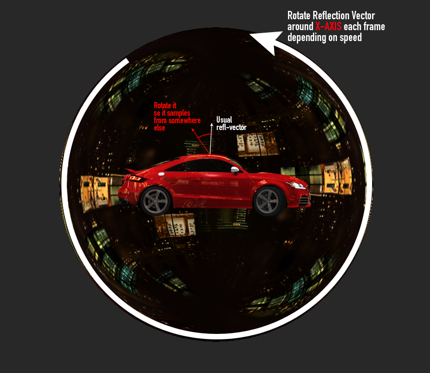
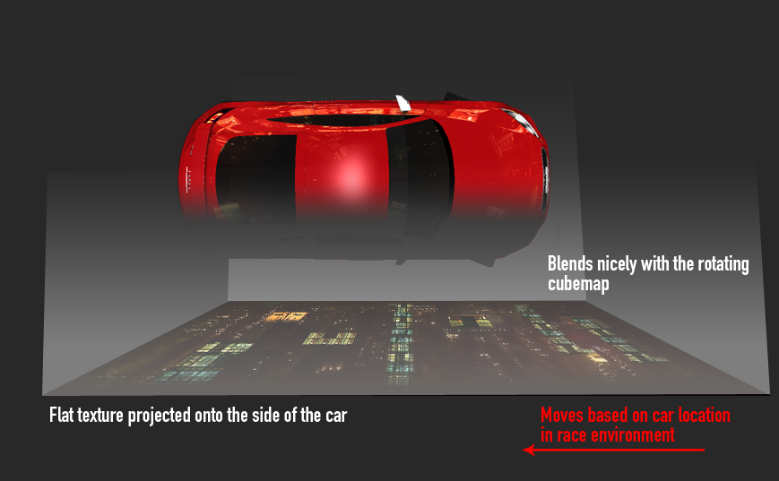

- <https://forum.unity.com/threads/how-to-create-the-same-realistic-car-effect-in-csr-racing.142586/#post-10282823

## 반사

- 보닛
  - 자동차 속도에 따라 셰이더의 반사 벡터를 회전합니다

- 측면
  - 자동차의 하향식 뷰에서 생성되며 높이에 따라 편평해집니다. 이는 정점 셰이더에서 수행됩니다
